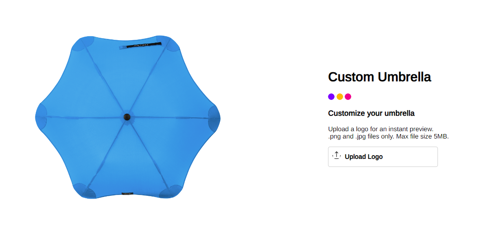
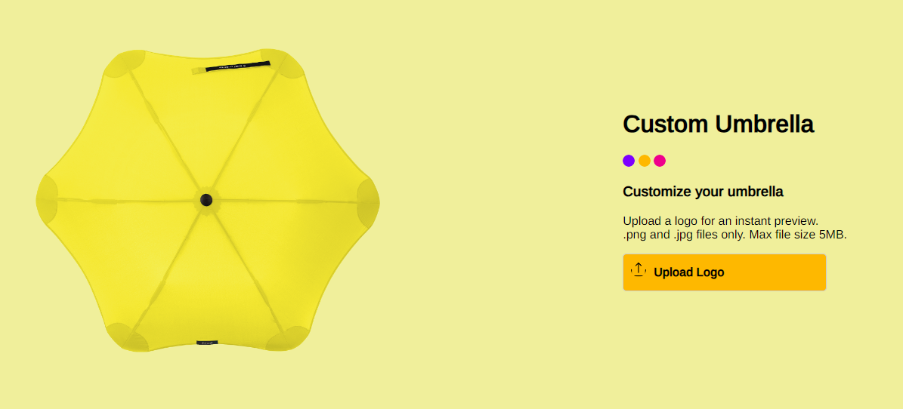
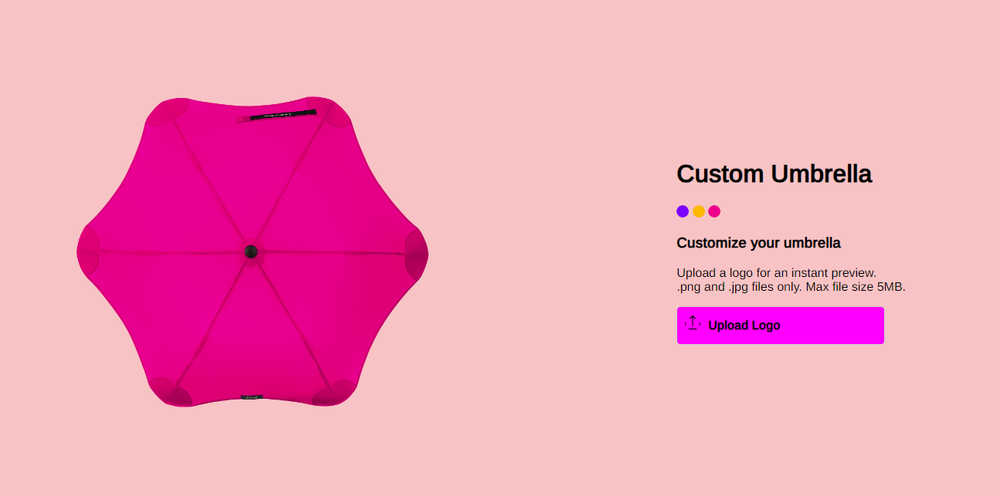
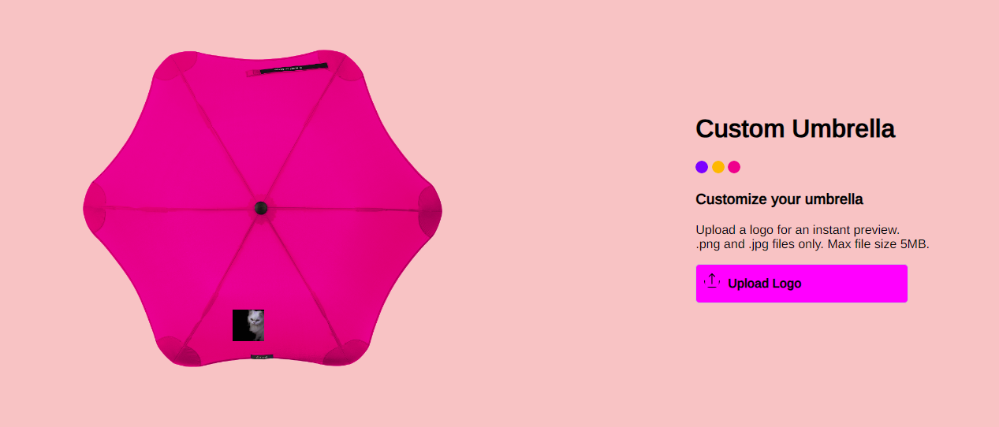

A project to customise your umbrella. You can change the color by clicking the three colors pink, yellow, blue and upload any logo to which will be updated to the bottom of the image.

At the first instance index file will be as:

Changing the color will be as:

While the image is being loaded, a loader will be displayed.

If we wish to add a logo to our the umbrella, we can add it by clicking upload logo button and the logo will be diplayed at the bottom of the umbrella, as

